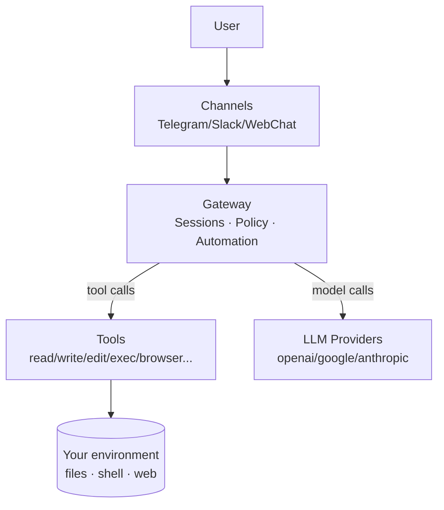

> Language: **English** | [한국어](/ko/posts/openclaw-what-is)

> Series: OpenClaw Deep Dive
> - Part 1 ✅ (this post)
> - Part 2: [OpenClaw architecture in one go: why Gateway is the runtime](/posts/openclaw-architecture-runtime)
> - Part 3: [OpenClaw prompts in one go: what really happens on “tell me the weather”](/posts/openclaw-prompt-runtime-trace)

> Note: This post is not a “setup guide.” It’s a quick concept + possibility overview. For model/provider setup, start with: /posts/openclaw-model-setup

If you’ve used AI assistants, you’ve probably seen this pattern:

The answer is good — but **the next step is missing**.
The execution still falls on you: open files, launch apps, check your calendar, organize things, and share the final output.

OpenClaw is a project built around that missing “next step.”
It’s not designed to make chat better.
It’s designed to make work actually **finish**.

## In one sentence

> OpenClaw is a local‑first agent runtime that connects an LLM to tools so it can perform real tasks.

Two words matter most in that sentence:

- **Local‑first**: your device, your accounts, your files are the center.
- **Tools**: not just words — actions that change the world (files/web/shell/messaging).

## Why does this exist? (problem definition)

Most day‑to‑day frustration with AI isn’t “the model isn’t smart enough.”
It’s “the model isn’t connected enough.”

- AI doesn’t know your file system → docs/code are disconnected
- AI is separate from your calendar/email/messages → preparation is slow
- AI can’t run repeated routines by itself → you still babysit everything

OpenClaw starts here. It’s built around **workflows**, not just conversation.

## The core loop (faster to understand as a diagram)

This is the default loop OpenClaw enables:

```plain text
Request (message)
  ↓
Policy check (allow / ask / deny)
  ↓
Plan (which tools are needed?)
  ↓
Tool execution (files / web / shell ...)
  ↓
Observe results (output / logs)
  ↓
Repeat if needed (edit → re-run)
  ↓
Final summary + record / notify
```

Once this loop clicks, AI usage shifts from **Q&A** to **request → done**.

## What can it do? (6 common scenarios)

You don’t need to be a developer. The most common value is “life/work operations automation.”

### 1) Recurring shopping routine (life automation)

Recurring purchases fail for one reason: you forget.
Water, detergent, pet supplies — it’s always the same problem.

With OpenClaw, shopping becomes an **operating routine**, not a one‑off act:

1. compute the next purchase window from a schedule / last purchase date
2. summarize what’s needed today
3. record the outcome (e.g., a Notion log)

The point isn’t “add items to cart.”
It’s “remove the moment you forget.”

### 2) Calendar briefing + preparation (links/materials/questions)

As schedules get crowded, what matters isn’t the event itself — it’s **being prepared**.

- summarize today/tomorrow chronologically + check conflicts / travel time
- collect links/materials + draft a list of questions
- send a reminder 1–2 hours before

This is not “view the calendar.”
It’s “don’t mess up the meeting.”

### 3) Ops‑style routine (email/messages/tasks)

If you react to notifications all day, your focus gets shredded.

OpenClaw fits routines like: “check only at set times, compress the important parts.”

- summarize long messages/emails into key points
- re‑prioritize unresolved items
- turn repeated patterns into templates

### 4) Writing/docs (research → structure → publishing prep)

Even outside blogging, many tasks look like: collect → summarize → structure.

- gather sources → summarize → outline → checklist
- keep links/grounds so you can re‑verify later

### 5) Personal projects / coding (optional)

Coding is optional. It’s powerful, but the core is “tool connection,”
so you can get value without touching code.

When you do want it, OpenClaw can run edit/test/build loops too.

### 6) Building a record system (logs / knowledge base)

What makes an assistant feel like “yours” is **records**.

What you did, what you decided, what you prefer — once it accumulates,
future work gets faster.

---

## What OpenClaw is great at vs where you should be careful

### Great at

- turning repeated work into routines — and connecting execution + logging
- multi‑step work (summarize → execute → verify → organize)
- consistent behavior through personal rules/memory

### Be careful with

- outbound/public sends (posts/external messages) → final confirmation is needed
- expanding permissions too much → bigger “blast radius” when mistakes happen

## A very shallow architecture peek

Part 2 covers this in depth, but for an intro, this mental model is enough:



## Getting started: minimal checklist

- choose primary/fallback model strategy (cost vs quality)
- decide approval rules for sensitive actions
- decide how you’ll keep records/memory
- automate just one routine first (shopping/calendar/check-ins)

---

## References

- Model setup guide: /posts/openclaw-model-setup
- Docs: https://docs.openclaw.ai

---

## FAQ

### Q. How much can it automate?

“What’s possible” is bounded by your tools.
The more you connect (files/shell/web/messaging/Notion/etc.), the broader automation becomes.

In practice, the most stable approach is: start with **one small routine**, then expand.

### Q. Is it risky? What about security/permissions?

Yes — anything with execution power has risk.

Three default rules:

- start with least privilege
- put **ask/approval** on sensitive actions
- add extra confirmation for sends/deletes/remote access

### Q. How much does it cost?

Cost depends on model choice, context length, and how many tool loops you run.

A common pattern is: lightweight model for most requests, and a stronger fallback for hard cases.

### Q. Who should not use this?

OpenClaw can be overkill if:

- you only want quick Q&A (no local execution)
- you don’t want any operating rules (approvals/permissions/records)
- you don’t want environment access (files/account integrations)

### Q. What should I do first?

Pick one everyday routine:
recurring shopping reminders, daily calendar briefings, or twice‑daily message/task summaries.

Once one routine runs even once, the expansion speed increases a lot.
