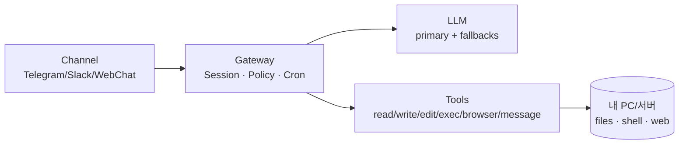

> 시리즈: OpenClaw 심층 탐구
> - 1편: [OpenClaw란 무엇인가](/posts/openclaw-what-is)
> - 2편 ✅ 현재

> Note: 이 글은 OpenClaw를 GitHub 코드 관점에서 “구조적으로” 이해하기 위한 분석 글이다. 문서/레포: https://docs.openclaw.ai · https://github.com/openclaw/openclaw

# OpenClaw 아키텍처 한 번에 이해하기: Gateway가 ‘런타임’인 이유

OpenClaw를 처음 쓰면 이렇게 느끼기 쉽다.

- “모델이 똑똑해서” 일이 된다

하지만 실전에서 문제가 터지는 지점은 보통 모델이 아니라 **운영** 쪽이다.

- 같은 말인데 대화 맥락이 섞인다(세션)
- 어떤 날은 명령이 실행되고, 어떤 날은 막힌다(권한/승인)
- 모델이 느려지거나 한도에 걸리면 흐름이 끊긴다(fallback)

그래서 2편의 결론은 단순하다.

> OpenClaw의 핵심은 LLM이 아니라, 그걸 ‘안정적으로 굴리는 런타임’이다.

---

## 한 문장 요약

OpenClaw는 **채널/세션/정책/도구/스케줄**을 Gateway에 모아 ‘런타임’으로 만들고,
모델(LLM)은 교체 가능한 부품처럼 붙인다.

---

## 그림으로 먼저 보기(이거 하나만 이해해도 절반은 끝)

이 그림을 말로 풀면 이렇다.

- 채널에서 메시지가 들어오면
- Gateway가 “이건 어떤 대화(세션)인지”를 잡고
- 정책을 적용한 다음
- 모델에게 물어보거나(LLM)
- 실제 행동을 실행한다(Tools)

여기서 중요한 포인트는 Gateway가 ‘모델 앞에 붙은 프록시’가 아니라,
**세션과 정책과 실행을 한 곳에서 운영하는 런타임**이라는 점이다.

---

## 1) Gateway가 하는 일: “대화”가 아니라 “운영”을 관리한다

주니어에게 가장 헷갈리는 부분부터 정리하자.

Gateway는 단순히 “요청을 받아 모델에 전달하는 서버”가 아니다.
OpenClaw에서 Gateway가 맡는 건 **운영**이다.

대표적으로 이런 일을 한다.

- 채널에서 들어온 메시지를 **어떤 세션에 붙일지** 결정한다
- 세션마다 **정책(권한/승인 규칙)** 을 적용한다
- 모델 호출과 tool calls를 **중간에서 조율**한다
- cron(리마인더/정기작업) 같은 **지속 기능**을 돌린다

즉, OpenClaw에서 Gateway는 서버라기보다 “컨트롤 플레인(control plane)”에 가깝다.

---

## 2) 세션(Session)이 중요한 이유: 컨텍스트 + 운영 상태가 한 묶음이다

세션은 “대화 로그”가 아니다. **대화를 운영하기 위한 묶음**이다.

세션에는 보통 이런 것들이 함께 붙는다.

- 지금 누구와 대화 중인지(채널/대상)
- 어떤 규칙으로 도구를 쓰는지(allowed/ask/deny 같은 정책)
- 결과를 실제 채널에 보낼지(deliver)
- 어떤 모델을 쓸지(override/fallback 포함)

이렇게 ‘운영 상태’가 세션에 붙어 있으면 무슨 장점이 있을까?

1) 맥락이 덜 섞인다
- 작업 A와 작업 B가 서로 영향을 주지 않는다

2) 위험한 행동은 자동으로 제동이 걸린다
- 예를 들어 `exec`처럼 위험한 도구는 “그냥 실행”이 아니라 승인/정책을 거치게 만들 수 있다

3) 모델이 바뀌어도 전체 흐름이 유지된다
- 모델이 느려지거나 실패해도, 세션은 그대로고 런타임이 다음 선택지를 고를 수 있다

---

## 3) Tools가 ‘일을 끝내는 감각’을 만든다 (그리고 그래서 위험하다)

LLM은 기본적으로 “생각”을 한다.

- 글을 쓴다
- 코드를 만든다
- 계획을 세운다

하지만 우리가 체감하는 ‘일이 끝남’은 대체로 Tools에서 나온다.

- 파일을 실제로 수정했다(read/write/edit)
- 명령을 실행했다(exec)
- 웹에서 버튼을 눌렀다(browser)
- 결과를 메시지로 보냈다(message)

여기서 `exec`가 특히 중요하다.

- 가장 강력하다(설치/빌드/자동화/로그 분석이 다 가능)
- 동시에 가장 위험하다(잘못 실행하면 시스템을 망가뜨릴 수 있음)

그래서 OpenClaw에서 중요한 건 “모델이 조심하겠지”가 아니라,
**Gateway가 정책/승인으로 위험 행동을 구조적으로 막아주는가**다.

---

## 4) 모델은 교체 가능해야 한다: primary/fallback은 운영 필수다

모델은 언제든 흔들린다.

- 한도(rate limit)
- 장애
- 응답 지연

이때 시스템이 모델 하나에 강하게 묶여 있으면, 사용자는 그냥 멈춘다.

OpenClaw는 모델을 ‘부품’처럼 다루려 한다.

- 모델이 잠깐 실패해도, 런타임이 계속 일을 이어가야 한다

그래서 primary/fallback을 두고 Gateway가 전환을 관리한다.
사용자는 “모델을 바꿨나?”보다 “작업이 끝났나?”가 중요하니까.

---

## 5) (코드 기반) 레포를 볼 때는 ‘파일명 외우기’ 말고, 키워드로 따라가면 된다

처음부터 파일 경로를 외우려고 하면 금방 지친다.
대신 레포에서 아래 키워드로 검색해보자.

- `session` / `session key`
- `deliver`
- `tool policy` / `approvals` / `ask`
- `cron`
- `gateway`

이 키워드들이 “왜 런타임이 필요한지”를 설명하는 실제 구현 지점으로 이어진다.

---

## (미니 실습) 세션이 분리되는 걸 30초 안에 체감해보기

OpenClaw TUI를 터미널 2개에서 띄우고, 세션 키를 다르게 주면 된다.

- 터미널 A: `openclaw tui --session chat-a`
- 터미널 B: `openclaw tui --session chat-b`

각 세션에서 서로 다른 주제로 대화를 해보면, 맥락이 섞이지 않는 걸 바로 느낄 수 있다.

---

## 요약

- OpenClaw의 핵심은 LLM이 아니라 Gateway 런타임 설계다
- 세션은 컨텍스트뿐 아니라 운영 상태(정책/딜리버리/모델)를 담는다
- Tools가 실행을 만들고, 그래서 정책/승인이 아키텍처가 된다
- 모델은 부품이므로 primary/fallback 같은 운영 설계가 필요하다

## 다음 편 예고

3편에서는 system prompt가 어떻게 “행동 일관성”을 만드는지(메모리/스킬/런타임 정보 주입 포함)를 다룬다.
