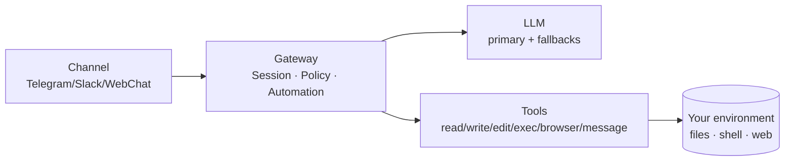

> Language: **English** | [한국어](/ko/posts/openclaw-architecture-runtime)

> Series: OpenClaw Deep Dive
> - Part 1: [What is OpenClaw](/posts/openclaw-what-is)
> - Part 2 ✅ (this post)
> - Part 3: [OpenClaw prompts in one go: what really happens on “tell me the weather”](/posts/openclaw-prompt-runtime-trace)

> Note: This post is a structural look at OpenClaw through the codebase. Docs/repo: https://docs.openclaw.ai · https://github.com/openclaw/openclaw

When you first try OpenClaw, it’s easy to think:

- “Things work because the model is smart.”

But in practice, the place where things break is usually not the model — it’s **operations**:

- the same words behave differently because context got mixed (**sessions**)
- on some days actions run, on other days they’re blocked (**policy/approvals**)
- when the model is slow or rate‑limited, the whole flow stalls (**fallbacks**)

So the conclusion of Part 2 is simple:

> OpenClaw’s core is not the LLM. It’s the runtime that keeps the system stable.

---

## One‑sentence summary

OpenClaw gathers **channels / sessions / policy / tools / scheduling** into the Gateway as a **runtime**,
while the LLM is treated like a replaceable component.

---

## Diagram first (this gets you halfway)

In plain words:

- a message comes in from a channel
- Gateway decides “which conversation is this?” (session binding)
- applies policy
- asks the model when needed
- executes real actions through tools

The key point is that the Gateway isn’t just a proxy sitting in front of the model.
It’s a runtime that **operates sessions, policy, and execution** in one place.

---

## 1) What Gateway does: it manages operations, not just “chat”

This is the most confusing part for many people at first.

Gateway is not merely a server that forwards requests to an LLM.
In OpenClaw, Gateway owns **operations**:

- routes incoming messages to the right **session**
- applies per‑session **policy (permissions/approvals)**
- coordinates model calls and tool calls
- runs long‑lived features like reminders/periodic jobs

It’s closer to a **control plane** than a typical API server.

---

## 2) Why Session matters: context + operating state are bundled

A session is not just a chat transcript.
It’s the unit that bundles **context + operating state**.

Typical session‑bound state:

- who you’re talking to (channel/recipient)
- which tools are allowed / ask / denied
- how outputs are delivered back to the channel
- which model to use (overrides + fallbacks)

Benefits:

1) **Less context mixing**
- work A and work B don’t leak into each other

2) **Dangerous actions get structural brakes**
- e.g. `exec` can be forced through approvals instead of “just run”

3) **The flow survives model instability**
- sessions stay, runtime picks alternatives when a model slows/fails

---

## 3) Tools are what make work feel “done” (and that’s why they’re risky)

LLMs primarily “think”:

- write text
- generate code
- make plans

But what users experience as “the job is done” usually comes from tools:

- editing real files (read/write/edit)
- running commands (exec)
- clicking on the web (browser)
- sending messages (delivery)

`exec` is the best example:

- extremely powerful (install/build/automation/log analysis)
- also extremely risky (a wrong command can break your system)

So the key is not “the model will be careful.”
It’s whether the Gateway can **structurally control risk** via policy/approvals.

---

## 4) Models must be swappable: primary/fallback is operationally required

Models wobble:

- rate limits
- outages
- latency spikes

If your system is tied to a single model, users just stop.

OpenClaw treats the model as a component:

- even if one provider fails, the runtime should keep the work moving

That’s why you set primary/fallback models and let the Gateway manage switching.
Users care less about “which model” and more about “did the task finish?”

---

## 5) (Code reading tip) Don’t memorize filenames — follow keywords

If you try to memorize file paths first, you burn out quickly.
Instead, search the repo by keywords:

- `session` / `session key`
- `deliver`
- `tool policy` / `approvals` / `ask`
- `cron`
- `gateway`

Those keywords will lead you to the real implementation points that explain “why a runtime exists.”

---

## Mini practice (30 seconds): feel session separation

Open two terminals and run the TUI with different session keys:

- Terminal A: `openclaw tui --session chat-a`
- Terminal B: `openclaw tui --session chat-b`

Talk about two unrelated topics in each session.
You’ll feel immediately that context doesn’t mix.

---

## Summary

- OpenClaw’s core is the Gateway runtime design, not the LLM
- sessions hold not only context but operating state (policy/delivery/model)
- tools create execution, so policy/approvals become architecture
- primary/fallback is essential operational design

## Next

Part 3 explains how system prompts and runtime context create *behavioral consistency*, with a concrete trace (“tell me the weather”).
