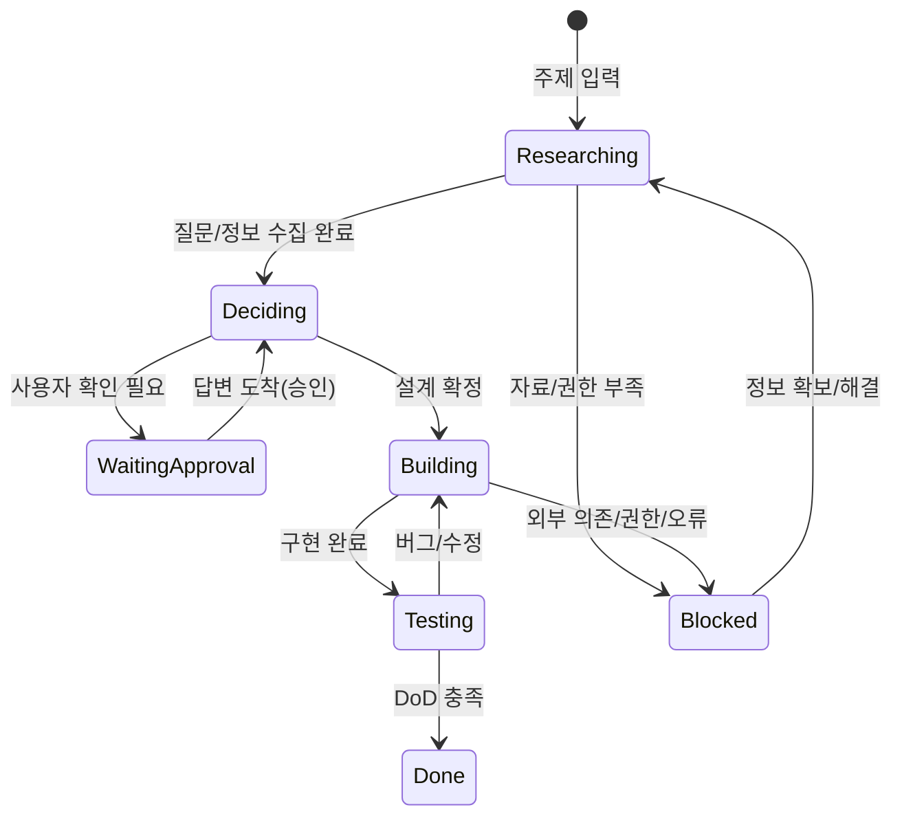

> 시리즈: OpenClaw 운영
> - 3편: [내부 동작과 운영 원리](/posts/openclaw-long-running-work-ops-1)
> - 4편 ✅ 현재: 실전 설정(이 글)

이 글은 “가계부 만들기” 같은 일을 OpenClaw에게 맡길 때, **사용자와 공유/수정/확인하면서** 며칠짜리 작업을 굴리는 실전 설정을 다룬다.

핵심 목표는 하나다.

- **이슈가 생기면**: Telegram으로 질문하고, 확인 후 진행한다.
- **이슈가 없으면**: 고정된 시간에 중간결과+다음계획을 Telegram으로 보고한다.
- 그리고 매번 깨어날 때: Notion을 읽고 “어디까지 했지?”를 복원해서 재개한다.

---

## 오늘 목표(DoD)

- Notion에 Projects/Task Queue/Decision Log 운영판이 있다
- Waiting approval/Blocked 상태가 “기다림”으로 강제된다(질문 없이 진행 금지)
- 정시 보고는 Cron(격리 세션 + announce)로 Telegram에 발송된다
- Heartbeat는 Notion을 읽고 복원→재개를 수행한다

---

## 0) 구성요소를 역할로 나눈다

- **Notion**: 운영판(단일 진실) — 상태/증거/다음 행동이 남는다
- **Heartbeat**: 주기적 재개 트리거 — Notion을 읽고 “어디부터 할지” 복원한다
- **Cron (isolated + announce)**: 정시 보고 트리거 — Telegram으로 바로 리포트를 보낸다
- **Telegram**: 공유 채널 — 질문(승인)과 리포트(정시 보고)가 여기로 온다

---

## 1) Notion 운영판 만들기 (필드=계약)

Notion은 문서가 아니라 **상태 저장소**다.

자동화가 읽고/쓰는 최소 단위는 ‘필드(컬럼)’이고, 이 필드가 흔들리면 재개가 아니라 재시작이 된다.

### A) Projects (프로젝트 1개 = 주제 1개)

- Name
- DoD(V0)
- Current status
- Next milestone
- Owner(사람)

### B) Task Queue (진짜로 굴러가는 엔진)

- Name
- Status(select)
- Next action(1줄)
- Blocked reason
- Evidence link
- Last updated(date)
- Brake?(checkbox)

권장 Status 고정값:

- Researching / Deciding / Building / Testing / Waiting approval / Blocked / Done

### C) Decision Log (짧게, 하지만 남는다)

- Decision
- Rationale
- Alternatives
- Evidence
- Next actions
- Date

---

## 2) ‘사용자 응답을 기다리기’를 시스템으로 강제하는 법

운영에서 가장 중요한 규칙은 이거다.

> **Status=Waiting approval (또는 Brake?=true)** 인 작업은
> “질문 메시지”만 만들고 더 진행하지 않는다.

이 규칙이 없으면, 에이전트는 착각으로 일을 끝까지 밀어버린다.

### Telegram 질문 템플릿(복붙)

```
[확인 필요] (결정 제목)
- 지금 막힌 이유: (한 줄)
- 선택지 A/B/C: (각 1줄)
- 내 추천: (1줄)
- 확정되면 다음 24~48h 계획: 1) 2) 3)
```

---

## 3) Heartbeat는 ‘진행’이 아니라 ‘복원+재개’에 쓰는 게 핵심

Heartbeat는 “계속 일하라”가 아니라 “다시 깨어나서 이어가라”에 가깝다.

그래서 Heartbeat 때 첫 번째로 해야 하는 일은 **Notion에서 상태를 복원**하는 것이다.

### Heartbeat 한 번에 하는 일(권장 순서)

1) Notion에서 Status=Waiting approval/Blocked인 Task를 조회
2) Waiting approval이면: 질문을 보냈는지 확인하고, 안 보냈으면 질문 발송 / 보냈으면 대기(중복 질문 금지)
3) Blocked이면: Blocked reason을 보강하고, 필요한 정보를 Telegram으로 요청
4) 진행 가능한 작업이 있으면: Next action 실행 → Evidence/Last updated 갱신

### Heartbeat 체크인 포맷(내부용)

```
오늘 상태: (Doing / Blocked / Waiting approval)
오늘 처리한 Task: (최대 3개)
새로 생긴 리스크/이슈: (1줄)
사용자에게 필요한 것: (승인/정보/시간)
다음 행동: (1줄)
```

---

## 4) Cron(announce, isolated)로 정시 보고 보내기

정시 보고는 “메인 세션이 깨어나야만 보내는 방식”보다,
Cron이 **격리 세션(isolated)**에서 돌고 결과를 **announce**로 Telegram에 바로 보내는 방식이 안정적이다.

- 메인 대화 히스토리를 더럽히지 않는다
- 정시성이 좋다

정시 보고는 질문이 아니다. 질문(승인 요청)은 조건부로만 보내고,
Cron은 “요약+다음계획”만 보내게 분리하면 메시지가 깔끔해진다.

### 정시 보고 메시지 템플릿(텔레그램)

```
[일일 리포트] (프로젝트명)
- 오늘 결과(3줄):
- 현재 막힘: (없음/있음 + 한 줄)
- 다음 계획(3줄):
- 내일 확인받고 싶은 것(있으면 1줄):
```

---

## 5) 실제로 어떻게 동작하나: 주제 1줄 → 요구수집 → 기획 → 개발

> 입력: “가계부 만들기”

### 요구수집: OpenClaw의 첫 출력(요약 + 질문 3개)

- 목표 요약(3줄)
- 질문 3개(우선순위 높은 것부터)
- 답변이 오면 Notion에 Projects/Task/Decision으로 구조화

### 개발: 막히면 질문, 안 막히면 정시 보고

- 인증/결제/외부 시스템 접근처럼 리스크가 커지면 Waiting approval로 질문
- 막힘이 없으면 Cron 리포트로 결과/다음 계획 공유

---

## (다이어그램) 설정 완료 후 실제 동작 흐름

```mermaid
flowchart TD
  U[사용자] -->|주제 1줄| OC[OpenClaw (main session)]
  OC -->|요구수집 질문| TG[Telegram]
  U -->|답변/승인| TG --> OC

  OC -->|Projects/Task/Decision 기록| NO[Notion 운영판]

  HB[Heartbeat (주기적)] --> OC
  OC -->|Notion 조회: Waiting approval/Blocked/Next action| NO
  OC -->|진행 가능하면 실행 + Evidence/Status 업데이트| NO
  OC -->|승인 필요하면 질문 전송| TG

  CR[Cron (isolated + announce)\n정시 보고] -->|Notion 요약 조회| NO
  CR -->|중간결과 + 다음계획| TG
```



---

## (보완) 실제 설정 예시 모음: Cron 등록 프롬프트 + Telegram 메시지 샘플

### A) (권장) Cron은 OpenClaw에게 ‘등록’시키기: 복붙 프롬프트

독자가 cron 표현식/옵션을 직접 조립할 필요는 없다.
아래 프롬프트를 OpenClaw에게 전달하면, OpenClaw가 필요한 질문만 한 뒤 스스로 cron job을 등록하고 테스트까지 진행하게 만들 수 있다.

```
[설정 요청] 정시 리포트용 Cron 등록

목표:
- 매일 정해진 시간에 ‘중간결과 + 다음계획’을 Telegram으로 자동 보고한다.
- 이 보고는 질문(승인 요청)이 아니라, 진행 상황 공유다.

요구사항:
1) Cron은 isolated 세션으로 실행하고, 결과는 Telegram으로 announce 방식으로 발송해라.
2) 보고를 만들 때는 Notion의 Projects/Task Queue/Decision Log를 조회해서 요약해라.
3) 보고 포맷은 아래 템플릿을 사용해라.
4) 실패하면 다음 실행 때 1회 재시도하고, 연속 실패 2회면 ‘설정에 문제가 있다’고 Telegram으로 알림을 보내라.
5) cron job을 등록한 뒤에는 “등록됨” 확인 메시지 + 다음 실행 시각을 알려줘.

보고 템플릿(텔레그램):
[일일 리포트] (프로젝트명)
- 오늘 결과(3줄):
- 현재 막힘: (없음/있음 + 한 줄)
- 다음 계획(3줄):
- 내일 확인받고 싶은 것(있으면 1줄):

추가 질문이 필요하면, 딱 3개 질문으로만 물어보고(우선순위 높은 것부터), 답이 오면 진행해라.
```

### B) Telegram 실제 발송 문장 샘플 3종

(1) 확인 질문(Waiting approval)

```
[확인 필요] 가계부 V0 범위
지금 막힌 이유: 입력 방식이 확정되지 않아서 다음 단계(설계)가 진행 불가

A) 수동 입력 중심(V0 빠름, 자동화는 V1)
B) 카드/은행 자동수집 포함(편하지만 난이도↑/인증 리스크↑)

내 추천: A로 V0 완료 → B는 V1 마일스톤

결정해주면 다음 24~48h에 할 일:
1) 데이터 모델 확정
2) 화면 플로우 1장
3) CSV 내보내기 스펙
```

(2) 정시 리포트(Cron)

```
[일일 리포트] 가계부 만들기

오늘 결과
- 요구사항 정리 초안 작성(목표/제약/우선순위)
- V0 DoD 확정: 수동 입력 → 월별/카테고리 집계 → CSV 내보내기
- Task Queue에 10개(48h 단위) 등록

현재 막힘
- 없음

다음 계획
- 데이터 모델(수입/지출/카테고리) 확정
- 입력 폼 화면 플로우
- 테스트 데이터 1세트 만들기

내일 확인받고 싶은 것
- 카테고리 체계를 기본 제공(고정)으로 할지, 사용자 커스텀을 V1로 미룰지
```

(3) 승인 후 재개 확인(짧게)

```
확인 고마워. V0는 ‘수동 입력’으로 확정했어.
지금부터: 데이터 모델 → 화면 플로우 → CSV 스펙 순서로 진행할게.
중간에 다시 확인 필요한 지점 생기면 바로 물어볼게.
```

---

## (실전 예시) 이 프롬프트를 넣으면 cron/보고가 이렇게 ‘굴러간다’

1) 사용자가 위 프롬프트를 전달한다
2) OpenClaw는 딱 3개만 추가 질문한다(시간/대상/요약 범위)
3) 답이 오면 OpenClaw가 cron을 등록하고, “등록됨 + 다음 실행”을 알려준다
4) 다음날 이슈가 없으면 정시 리포트가 온다
5) 이슈가 생기면 정시 리포트와 분리된 “확인 질문(Waiting approval)”이 우선한다
