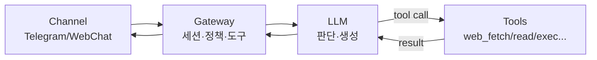
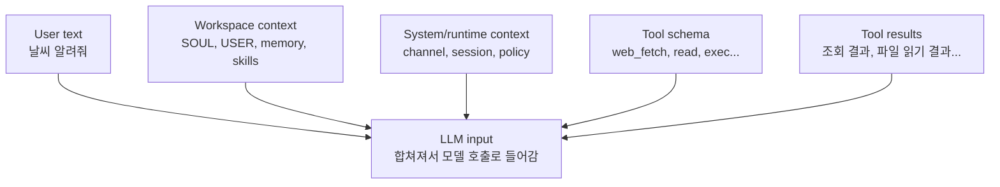

> Language: [English](/posts/openclaw-prompt-runtime-trace) | **한국어**
>
> 시리즈: OpenClaw 심층 탐구
> - 1편: [OpenClaw란 무엇인가](/ko/posts/openclaw-what-is)
> - 2편: [OpenClaw 아키텍처 한 번에 이해하기](/ko/posts/openclaw-architecture-runtime)
> - 3편 ✅ 현재

> Note: 이 글은 “날씨 알려줘” 한 문장이 런타임(Gateway)에서 어떻게 처리되는지, 프롬프트/세션/정책/도구 관점으로 따라갑니다. 프롬프트 발췌는 **형태만** 보여주며 민감 값은 마스킹합니다.

이 글은 개념부터 길게 설명하지 않는다. “날씨 알려줘” 같은 짧은 요청이 실제로 어떻게 처리되는지부터 본다. 그 다음에야 세션/정책/도구/딜리버리 같은 단어에 의미를 붙인다.

---

## 한 문장 요약

OpenClaw에서는 LLM이 “판단/생성”을, Gateway가 “세션/정책/도구 실행/딜리버리”를 맡는다. 이 글은 그 분리를 “날씨 알려줘” 한 문장으로 체감하게 만드는 게 목표다.

```plain text
채널(텔레그램) → Gateway(세션/정책/도구) → LLM(판단/생성) ↔ Tools(실행) → Gateway → 채널
```

---

## 그림으로 먼저 보기(이거 하나만 이해해도 절반은 끝)



---

## 프롬프트는 뭐가 들어가나(가공/발췌)

보안/가독성을 위해 실제 값(토큰/내부 식별자/개인정보/전체 시스템 프롬프트 전문)은 숨기고, “형태”만 가공해 보여준다.

```plain text
# (가공/발췌) 모델 호출 직전에 들어가는 입력의 ‘형태’ 예시
# ※ 실제 값(토큰/내부 식별자/개인정보/전체 시스템 프롬프트 전문)은 모두 마스킹됨

[System / Runtime context]
- channel: telegram (direct DM)
- sender_id: [REDACTED]
- timezone: Asia/Seoul
- session: agent:main:main
- policies:
  - 외부 전송/삭제/exec 등 민감 동작은 확인(ask) 또는 제한(deny)
  - 도구는 허용 목록(allowlist) 안에서만 호출 가능

[System / Tools schema]
- tools available to the model (examples):
  - web_fetch(url, extractMode)
  - read(path), write(path, content), edit(...)
  - exec(command)
  - message.send(...)

[Workspace]
- SOUL.md / USER.md / (선택) memory / skills 문서 등
  - 목표: 말투가 아니라 ‘행동 규칙/우선순위/안전 경계’를 고정

[User]
날씨 알려줘

--- (이후, 모델이 tool call을 생성하면)

[Tool result]
web_fetch 결과: "Seoul: +2°C, Light rain"  # 예시

--- (그리고 모델은 이 결과를 근거로 최종 응답을 작성)
```

---

## 그림으로 보기: 프롬프트 레이어 합성



요지는 단순하다. 유저 문장만 모델에 들어가는 게 아니라, “운영 컨텍스트(세션/정책) + 할 수 있는 행동(도구) + 작업 근거(툴 결과)”까지 함께 들어가서 모델의 판단을 만든다.

---

핵심은 “LLM이 다 한다”가 아니라, Gateway가 운영(세션/정책/실행/반환)을 맡고 LLM은 판단과 글쓰기를 맡는다는 분리다.

---

## 1) 트레이스: “날씨 알려줘”는 실제로 이렇게 처리된다

아래는 “한 번의 요청”이 끝날 때까지 벌어지는 일을 순서대로 적은 것이다.

### 1-1. 채널에서 메시지가 들어온다

1. 유저가 텔레그램에 “날씨 알려줘”를 보낸다.
2. 메시지 텍스트 + 메타데이터(누가/어디서/리플인지)가 Gateway로 들어온다.

### 1-2. Gateway가 세션에 붙인다(세션 바인딩)

1. Gateway는 이 메시지를 “어느 대화(세션)”에 붙일지 결정한다.
2. 세션은 단순 대화 로그가 아니라, 운영 상태(정책/딜리버리/모델 선택)가 같이 묶인 단위다.

### 1-3. LLM에게 ‘현재 상황’을 한 번에 준다(프롬프트 레이어)

여기서 “프롬프트”는 유저 문장만을 뜻하지 않는다. 시스템/런타임 정보와 워크스페이스 컨텍스트가 같이 들어가서, 모델이 무엇을 알고 무엇을 할 수 있는지(도구)를 규정한다.

```plain text
# (개념) LLM 호출에 들어가는 입력은 보통 이렇게 합쳐진다

[system]
- 런타임 규칙(안전/제약)
- 사용 가능한 도구 스키마(예: web_fetch, read, exec, message ...)
- 채널/세션 메타데이터(예: telegram DM, 대상 id, timezone 등)

[workspace]
- 에이전트 운영 컨텍스트(예: SOUL/USER/메모리/스킬)

[user]
날씨 알려줘

# 참고: 도구 목록은 보통 “텍스트”로 붙는다기보다,
# 모델 요청의 tool schema(함수 목록)로 함께 전달된다고 이해하면 된다.
```

이 레이어 조합 덕분에 모델은 “지금 텔레그램에서 온 요청”이라는 맥락과 “조회 가능한 도구가 있다”는 사실을 동시에 인지하고, 다음 단계(도구 호출 여부)를 결정할 수 있다.

- 시스템 레이어: 안전 규칙, 사용할 수 있는 도구 목록(스키마), 채널/세션 컨텍스트
- 워크스페이스 레이어: 에이전트 성향/규칙(SOUL), 사용자 정보(USER), 필요한 경우 메모리/스킬
- 유저 레이어: “날씨 알려줘”

### 1-4. LLM은 “도구가 필요하다”를 판단한다(1차)

여기서 핵심은 “모델이 답을 쓰기 전에, 도구를 쓸지 말지를 먼저 결정한다”는 점이다.

```plain text
# (개념) 모델이 내리는 결정은 보통 이런 형태다

if 최신 데이터가 필요하다:
    tool_call = web_fetch(url="https://wttr.in/Seoul?format=3")
    return tool_call
else:
    return 최종응답
```

여기서 web_fetch 실행 자체는 모델이 아니라 Gateway가 한다. 모델은 “이 도구를 이 인자로 호출하라”는 의도(툴콜)를 만든다.

1. 날씨는 최신 데이터가 필요하므로, LLM은 “추측하지 말고 조회하자”를 선택한다.
2. LLM은 “어떤 도구를 어떤 인자로 호출할지”를 제안한다.

중요: 이 시점에 LLM이 웹을 직접 긁는 게 아니다. “도구 호출 의도”만 만든다.

### 1-5. Gateway가 실제 도구를 실행한다

1. Gateway가 web_fetch 같은 도구를 실제로 실행해서 결과를 얻는다.
2. 이 결과(텍스트/JSON)가 다시 LLM 입력에 붙는다.

### 1-6. LLM이 결과를 근거로 최종 답을 쓴다(2차)

1. LLM은 도구 결과를 근거로 “최종 응답 문장”을 생성한다.
2. Gateway가 그 응답을 텔레그램으로 보낸다(딜리버리).

---

## 2) 이 트레이스에서 ‘OpenClaw가 런타임인 이유’가 드러난다

지금 본 흐름을 기능별로 쪼개면 OpenClaw의 설계가 명확해진다.

- Channel: 메시지가 들어오고 나가는 입구/출구
- Session: 컨텍스트 + 운영 상태(정책/딜리버리/모델)가 묶이는 단위
- Policy/Approvals: 위험한 행동을 구조적으로 막는 장치
- Tools: “일이 끝남”을 만드는 실행 표면(read/write/edit/exec/web_fetch/...)
- LLM: 판단/계획/요약/문장 생성(=두뇌), 하지만 실행 주체는 아님
- Delivery: 결과를 어디로 어떻게 보낼지(세션 바인딩과 결합)

> ⚠️ 착각 방지(자주 하는 오해 2개)
> - 오해 #1: LLM이 ‘실행 주체’다 → 실제 실행은 Gateway가 도구(tool)를 호출해서 한다. LLM은 도구 호출 ‘의도/계획’을 만든다.
> - 오해 #2: 프롬프트 = 유저 문장 1개다 → 시스템/세션/정책/도구 스키마/워크스페이스 컨텍스트/툴 결과가 합쳐져서 모델의 판단이 만들어진다.

---

## 3) 한 줄 결론

“날씨 알려줘” 한 문장이 처리되는 동안, LLM은 판단과 글쓰기를 하고, Gateway는 세션/정책/도구 실행/반환을 운영한다. 그래서 OpenClaw의 핵심은 모델이 아니라 런타임(Gateway) 설계다.
