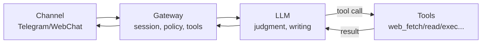
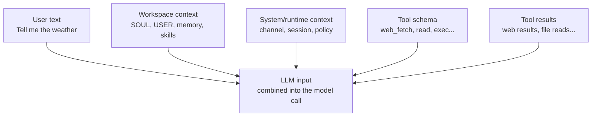

> Language: **English** | [한국어](/ko/posts/openclaw-prompt-runtime-trace)

> Series: OpenClaw Deep Dive
> - Part 1: [What is OpenClaw](/posts/openclaw-what-is)
> - Part 2: [OpenClaw architecture in one go: why Gateway is the runtime](/posts/openclaw-architecture-runtime)
> - Part 3 ✅ (this post)

> Note: We follow one short request (“tell me the weather”) end‑to‑end through the runtime (Gateway) — from prompts/sessions/policy to tools and delivery. The prompt excerpt is **shape only**; sensitive values are redacted.

We won’t start with long theory.
We start with a tiny request and trace what actually happens:

> “Tell me the weather.”

Then we name what we just saw: session, policy, tools, delivery.

---

## One‑sentence summary

In OpenClaw, the LLM handles **judgment + writing**.
The Gateway handles **sessions + policy + tool execution + delivery**.
This post makes that separation tangible using one request: “tell me the weather.”

```plain text
Channel (Telegram) → Gateway (session/policy/tools) → LLM (judge/write) ↔ Tools (execute) → Gateway → Channel
```

---

## Diagram first (this gets you halfway)



---

## What goes into “the prompt” (edited excerpt)

For security and readability, we hide real tokens/IDs/PII and show only the **shape**.

```plain text
# (edited excerpt) The rough shape of inputs at model-call time
# Sensitive values are redacted.

[System / Runtime context]
- channel: telegram (direct DM)
- sender_id: [REDACTED]
- timezone: Asia/Seoul
- session: agent:main:main
- policies:
  - sensitive actions (send/delete/exec) require confirmation (ask) or are restricted (deny)
  - tools can be called only from an allowlist

[System / Tools schema]
- tools available to the model (examples):
  - web_fetch(url, extractMode)
  - read(path), write(path, content), edit(...)
  - exec(command)
  - message.send(...)

[Workspace]
- SOUL.md / USER.md / (optional) memory / skills
  - goal: not “tone”, but stable behavior rules and safety boundaries

[User]
Tell me the weather

--- (later, if the model creates a tool call)

[Tool result]
web_fetch result: "Seoul: +2°C, Light rain"  # example

--- (then the model writes the final response based on this)
```

---

## Diagram: how prompt layers merge



The point is simple:
it’s not only the user sentence that enters the model.
**operating context (session/policy) + available actions (tools) + evidence (tool results)** also shape the model’s decision.

---

The key idea is not “the LLM does everything.”
It’s the separation: Gateway runs operations (session/policy/execute/deliver), while the LLM decides and writes.

---

## 1) Trace: what actually happens on “tell me the weather”

Below is the end‑to‑end sequence for a single request.

### 1-1. A message enters from the channel

1. The user sends “tell me the weather” in Telegram.
2. The text + metadata (who/where/reply context) enters the Gateway.

### 1-2. Gateway binds it to a session

1. Gateway decides which session this message belongs to.
2. A session is not just chat history; it also bundles operating state (policy/delivery/model selection).

### 1-3. The model receives the full situation (prompt layers)

Here “prompt” does not mean “the user sentence only.”
System/runtime info and workspace context are included, defining what the model knows and what it can do (tools).

```plain text
# (concept) Model input is typically composed like this

[system]
- runtime rules (safety/constraints)
- available tool schema (web_fetch, read, exec, message ...)
- channel/session metadata

[workspace]
- agent context (SOUL/USER/memory/skills)

[user]
Tell me the weather

# note: tools are usually passed as a function schema, not as plain text.
```

Thanks to this composition, the model can recognize both:
- “this came from Telegram”
- “I can fetch fresh data using tools”

### 1-4. The model decides it needs a tool (first pass)

The key is: before writing an answer, the model decides whether to use a tool.

```plain text
# (concept) The decision often looks like this

if fresh data is required:
    tool_call = web_fetch(url="https://wttr.in/Seoul?format=3")
    return tool_call
else:
    return final_answer
```

The important detail:
web_fetch execution is done by the Gateway, not the model.
The model only produces the *intent* (tool call).

### 1-5. Gateway runs the tool

1. Gateway executes web_fetch (or other tools) and gets a result.
2. The result is appended back into the model input.

### 1-6. The model writes the final answer (second pass)

1. The model writes the final response grounded in tool results.
2. Gateway delivers it back to Telegram.

---

## 2) Why this trace explains “OpenClaw is a runtime”

If we label responsibilities, the design becomes obvious:

- **Channel**: input/output entry points
- **Session**: context + operating state
- **Policy/Approvals**: structural brakes on risky actions
- **Tools**: the execution surface (read/write/edit/exec/web_fetch/...)
- **LLM**: judgment/planning/summarizing/writing — but not the execution agent
- **Delivery**: where/how to send results (bound to sessions)

> ⚠️ Two common misconceptions
> - Misconception #1: “the LLM executes” → execution is done by Gateway via tools; the LLM outputs intent.
> - Misconception #2: “prompt = one user sentence” → system/session/policy/tool schema/workspace + tool results shape the model.

---

## 3) One‑line conclusion

While “tell me the weather” is being handled, the LLM decides and writes, and the Gateway operates sessions/policy/tool execution/delivery.
That’s why OpenClaw’s core value is the **runtime (Gateway)**, not the model.
