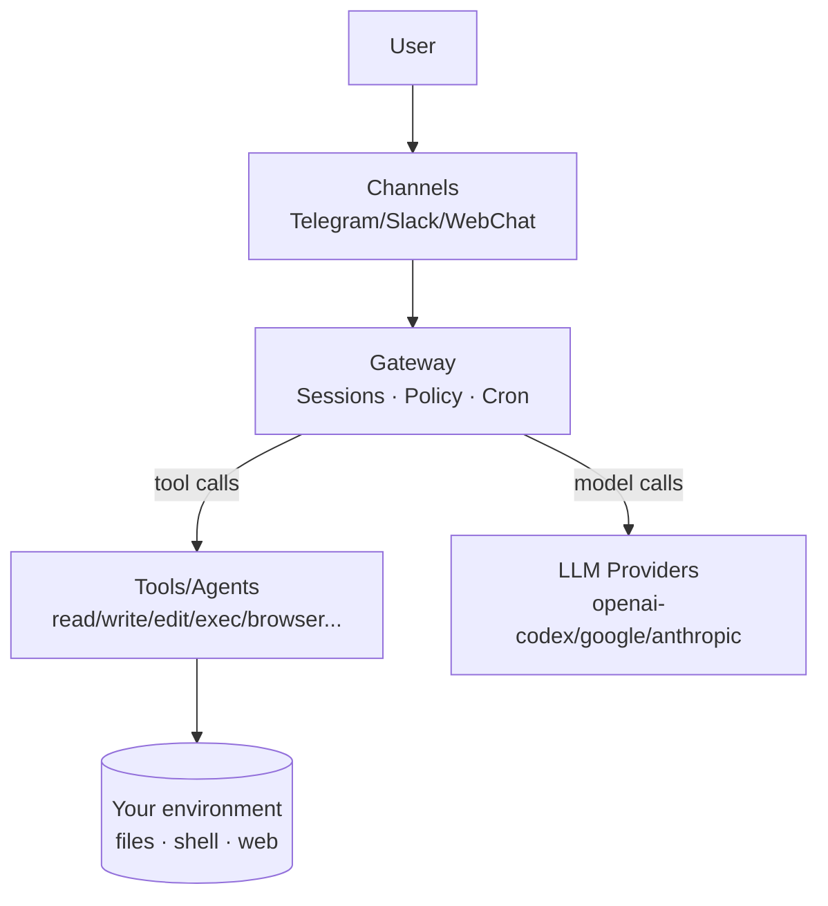

> 시리즈: OpenClaw 심층 탐구
> - 1편 ✅ 현재
> - 2편: [OpenClaw 아키텍처 한 번에 이해하기](/posts/openclaw-architecture-runtime)
> - 3편: [OpenClaw 프롬프트 한 번에 이해하기](/posts/openclaw-prompt-runtime-trace)

> Note: 이 글은 OpenClaw를 “설정 가이드”가 아니라 “개념/가능성 분석”으로 소개합니다. 연결/모델 설정은 먼저 [OpenClaw 모델 연결 가이드](https://blog.devori.app/posts/openclaw-model-setup)를 참고하세요.

AI를 써보면 금방 이런 장면을 겪는다.

질문하면 답은 잘 나온다. 그런데 “그 다음”이 없다. 실행은 결국 사람이 한다. 파일을 열고, 앱을 켜고, 캘린더를 확인하고, 정리해서 공유한다.

OpenClaw는 그 “그 다음”을 붙이는 프로젝트다. 대화를 잘하게 만드는 게 아니라, 작업이 끝나게 만드는 쪽으로 설계되어 있다.

## 한 문장으로

> OpenClaw는 LLM을 도구와 연결해, 실제 작업을 수행하게 만드는 Local-first 에이전트 런타임이다.

이 정의에서 핵심 단어는 두 개다.

- Local-first: 내 로컬/내 계정/내 파일을 중심에 둔다
- Tools: 말이 아니라 행동(실행)을 가능하게 한다
## 왜 이런 게 필요할까? (문제 정의)

일상적인 AI 사용에서 불편함은 대부분 “지능 부족”이 아니라 “연결 부족”에서 나온다.

- AI는 내 파일 시스템을 모른다 → 문서/코드가 분리된다
- AI는 내 일정/메일/메시지와 분리돼 있다 → 준비가 늦는다
- AI는 반복 작업을 스스로 돌릴 수 없다 → 매번 사람이 챙긴다
OpenClaw는 여기서 출발한다. “대화”가 아니라 “워크플로우”를 중심에 둔다.

## 그림으로 보면 더 빠르다

아래 흐름이 OpenClaw가 제공하는 기본 루프다.

```plain text
요청(메시지)
  ↓
정책 확인(허용/승인)
  ↓
계획 수립(어떤 도구가 필요한가)
  ↓
도구 실행(파일/웹/터미널…)
  ↓
결과 관찰(출력/로그)
  ↓
필요하면 반복(수정 → 재실행)
  ↓
최종 요약 + 기록/알림
```
한 번 이 루프가 붙으면, AI 사용이 “질문/답변”에서 “요청/완료”로 넘어간다.

## 무엇을 할 수 있나 (일반적인 시나리오 6가지)

개발이 없어도 충분히 쓸모가 있다. “생활/업무 운영 자동화”가 가장 보편적이다.

### 1) 정기 쇼핑 루틴 (쿠팡 같은 생활 자동화)

정기 구매가 필요한 것들은 결국 “까먹음”이 문제다. 생수/세제/반려동물 용품은 더 그렇다.

OpenClaw로는 쇼핑을 “구매 행위”가 아니라 “운영 루틴”으로 바꿀 수 있다.

1. 주기/마지막 구매일 기준으로 다음 구매 시점 계산
1. 오늘 필요한 품목만 요약 알림
1. 구매 여부를 기록(노션 작업일지 등)으로 반영
포인트는 장바구니 대신 담는 게 아니라, 놓치는 순간을 없애는 시스템을 만드는 것이다.

### 2) 캘린더 브리핑 + 준비물/자료 준비

일정이 많아질수록 중요한 건 일정 자체가 아니라 “준비 상태”다.

- 오늘/내일 일정 시간순 요약 + 겹침/이동 시간 체크
- 회의 전 필요한 링크/자료/질문 리스트 정리
- 회의 1~2시간 전 준비 리마인드
포인트는 “캘린더 보기”가 아니라 “회의를 망치지 않게 만드는 준비 자동화”다.

### 3) 생활형 운영 루틴 (메일/메시지/할 일)

하루 종일 알림을 실시간 처리하면 집중력이 갈린다.

OpenClaw는 “정해진 시간에만 점검하고 중요한 것만 압축”하는 루틴에 잘 맞는다.

- 긴 메시지/메일을 핵심만 요약
- 미해결 항목 우선순위 재정렬
- 반복 패턴 템플릿화
### 4) 글/문서 작업 (리서치 + 정리 + 발행 준비)

블로그가 아니라도, 보고서/회의록/제안서처럼 “자료 모으고 정리하고 구조화”하는 일은 많다.

- 자료 수집 → 요약 → 논리 구조 → 체크리스트로 정리
- 링크/근거를 남겨서 재검증 가능하게 만들기
### 5) 개인 프로젝트/코드 작업 (선택적)

코드 작업은 선택지다. 강력하긴 하지만, 본질은 “도구 연결”이기 때문에 코드가 없어도 된다.

필요할 때는 코드 수정/테스트/빌드 같은 루프도 붙일 수 있다.

### 6) 기록 시스템 구축 (작업일지/지식베이스)

OpenClaw를 진짜 “내 비서”로 만드는 건 결국 기록이다.

무슨 일을 했는지, 어떤 결정을 했는지, 무엇을 선호하는지 — 이게 쌓이면 다음 작업이 빨라진다.


---

## OpenClaw가 잘하는 것 vs 잘 못하는 것

### 잘하는 것

- 반복 업무를 루틴으로 만들고, 실행/기록까지 연결
- 여러 도구를 묶은 멀티스텝 작업(요약→실행→검증→정리)
- 개인화(규칙/기억) 기반으로 일관된 행동
### 조심해야 하는 것

- 외부 전송(공개 글/대외 메시지)은 최종 확인이 필요
- 권한을 크게 열면 실수의 반경도 커진다 → 최소 권한 + 승인
## 아키텍처를 아주 얕게만 보면

이 시리즈 2편에서 자세히 다루겠지만, 입문편에서는 이 정도만 잡아도 된다.


## 시작하기: 최소 구성 체크리스트

- 모델 primary/fallback 전략 세우기 (비용/품질 균형)
- 민감 작업 승인 정책 정하기
- 작업일지/기억 파일 운영 방식 정하기
- 자주 쓰는 루틴(쇼핑/일정/점검) 1개만 먼저 자동화

---

## 참고

- OpenClaw 모델 연결 가이드: https://blog.devori.app/posts/openclaw-model-setup
- OpenClaw 문서: https://docs.openclaw.ai

---

## FAQ

입문 단계에서 자주 나오는 질문들을 미리 정리해둡니다.

### Q. 자동화는 어디까지 가능한가?

“할 수 있는 것”은 도구의 범위로 결정됩니다. 파일/터미널/웹/메시징/노션/크론처럼 연결된 도구가 많을수록 자동화 범위가 넓어집니다.

다만 현실적으로는 “작은 루틴 1개”부터 시작해서 점진적으로 확장하는 게 가장 안정적입니다.

### Q. 보안/권한이 걱정된다. 위험하지 않나?

맞아요. 실행력이 강한 시스템은 항상 리스크가 있습니다.

그래서 기본 원칙은 3가지입니다:

- 최소 권한으로 시작하기
- 민감 동작은 승인(ask) 걸기
- 외부 전송/삭제/원격접속 같은 건 별도 확인 절차 두기
### Q. 비용은 얼마나 드나?

비용은 “모델 선택 + 컨텍스트 길이 + 작업 루프 횟수”에 의해 결정됩니다.

실무에서는 primary는 가벼운 모델로, 어렵거나 코드 작업은 fallback/서브에이전트로 돌리는 구성이 가장 무난합니다.

### Q. 어떤 사람에게는 비추인가?

다음 케이스라면 OpenClaw가 과할 수 있습니다.

- “그냥 빠른 Q&A만 필요”하고 로컬 실행/자동화가 필요 없는 경우
- 운영 규칙(승인/권한/기록)을 만들 생각이 전혀 없는 경우
- 환경 접근(로컬 파일/계정 연동)을 원치 않는 경우
### Q. 제일 먼저 뭘 하면 좋나?

생활 루틴 1개를 고르는 걸 추천합니다. 예: 정기 쇼핑 알림, 일정 브리핑, 하루 2번 메시지/할 일 요약.

루틴이 “한 번이라도” 돌아가면, 그 다음부터는 확장 속도가 빨라집니다.
